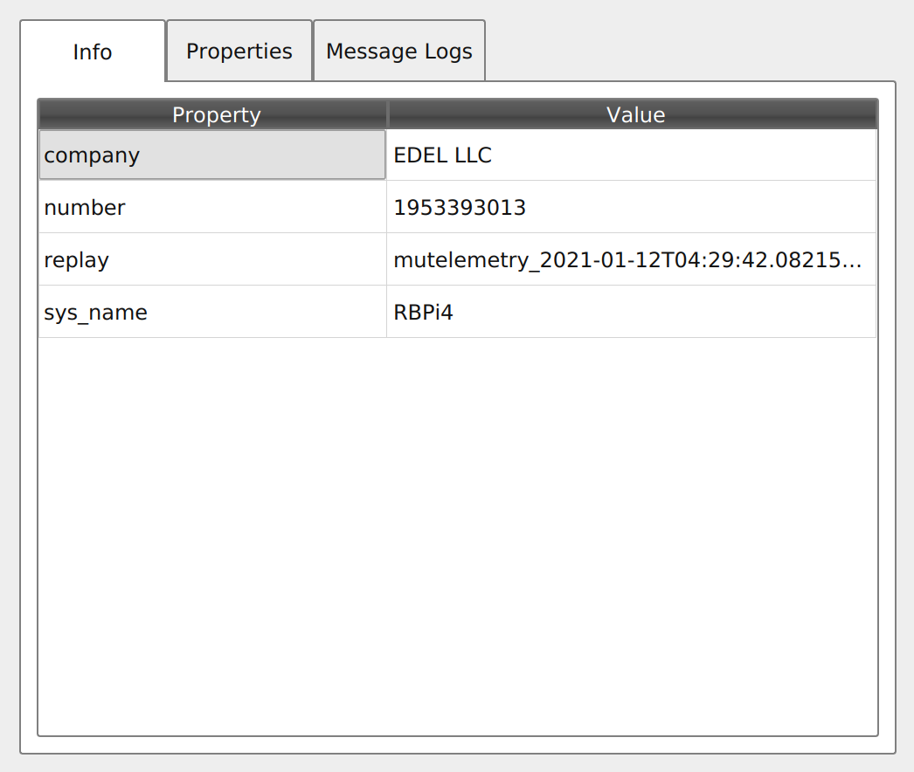
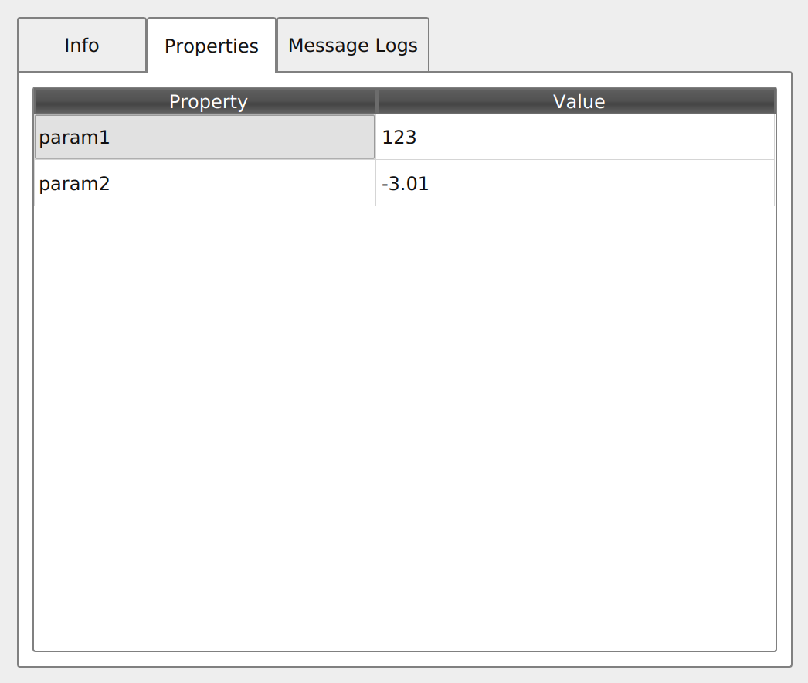

## Ulog logging and telemetry guide

Initialize underlying system
```cpp
    bool realtime = false;  // don't run telemetry discard thread for test
    if (use_network)
        MuTelemetry::init(roster, realtime);
    else
        MuTelemetry::init(nullptr, realtime);

    MuTelemetry &mt = MuTelemetry::getInstance();
    if (!mt.is_enabled()) return 1;
```

Set meta info and session configuration
```cpp
    mt.register_info("company", "EDEL LLC");
    mt.register_info("sys_name", "RBPi4");
    mt.register_info("replay", mt.get_logname());
    mt.register_info("number", 0x23434343);
```



Register session-wide parameters in a specific section
```cpp
    mt.register_param("int32_t param1", 123);
    mt.register_param("float param2", -3.01f);
```
This is how does it look in ulog viewer




Now setup data types
```cpp
    mt.register_data_format(DataType0::name(), DataType0::fields());
    mt.register_data_format(DataType1::name(), DataType1::fields());
    mt.register_data_format(DataType2::name(), DataType2::fields());
    mt.register_data_format(DataType3::name(), DataType3::fields());
    mt.register_data_format("DataType4", "DataType3[3] array;");
```

Do actual data logging
```cpp
    ret = MuTelemetry::getInstance().store_data(
            shared_ptr<Serializable>{new DataType0Serializable},
            DataType0::name(), "d01");
    if (ret) {
        ret = MuTelemetry::getInstance().store_data(
        shared_ptr<Serializable>{new DataType0Serializable},
        DataType0::name(), "d02");
    }
```

Complete example could be found [here](/examples/mutelemetry_example.cc)
